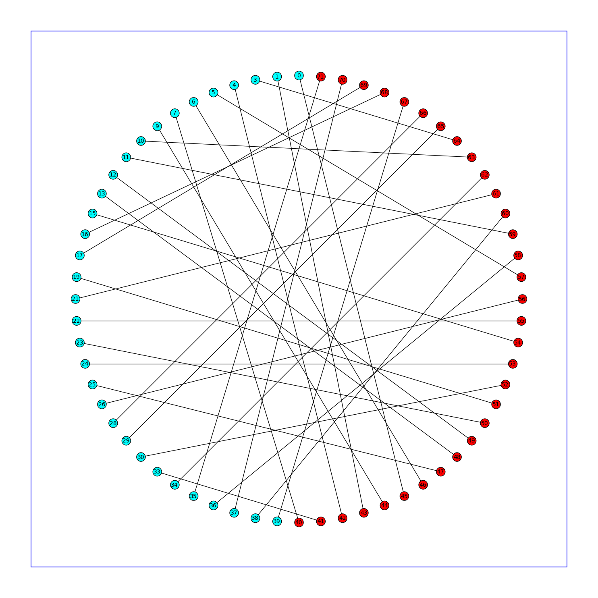

Slides for a talk for Rhys Phillip's radio show.

As this was on the radio, the slides are not at all visual (simply acting as prompts for myself).
Here are some notes corresponding to the talk:

# Introduction

## Who am I?

- Third Culture Kid
- Mathematician
- Pure Mathematics and then Operational Research

## What am I going to talk about?

Mathematical Modelling techniques can be used to model a variety of things (road traffic, mechanical phenomenon, human beings...).
I will today talk about how such modelling techniques can be applied to healthcare.

# Healthcare issues

## Difficulties in healthcare that I am no going to talk about.

My wife is in the audience and she builds in vitro lungs.
This can be used to see how drugs work...

When drugs get developed they go through years of research and development which involves a huge amount of statistical analysis.

Some friends I follow on social media (David Basanta) work on modelling Cancer growth using Game Theory.

I won't be talking about that.

## If a patient arrives every 4 hours and it takes 4 hours to treat them how long will people wait?

Discuss this simple issue.

In reality patients, don't arrive at exactly 4 hour intervals. They arrive according to a distribution:

This has a huge effect on the performance of a system:

- Mean time in system: 20 hours +

Here's a video on YouTube describing this: [https://www.youtube.com/watch?v=i3ZEqc8dkZk](https://www.youtube.com/watch?v=i3ZEqc8dkZk).

## Bed management

This is what we're interested in.

- How many doctors should I have on during any one shift at the EU?
- Where should ambulances be located?
- When should surgeries take place?

# Operational Research

## Born during the Second World War

"... scientific method of providing executive departments with a quantitative basis for decisions regarding the operations under their control."

Blackett: reduced number of artillery rounds needed, looked in to convoy sizes etc...

## Hard to define

Current (wikipedia) definition of Operational Research: `a discipline that deals with the application of advanced analytical methods to help make better decisions'.

## Toolkit

Best thought of as a toolkit for various uses:

- Game Theory;
- Queueing Theory;
- Statistical Analysis;
- Inventory Theory;
- Data mining;
- Simulation;
- Probabilistic modelling.

## Scheduling

Not something I am a specialist in myself: we have two specialist here at Cardiff University: [Rhydian Lewis](http://www.cardiff.ac.uk/maths/contactsandpeople/profiles/lewisr9.html) and [Jonathan Thompson](http://www.cardiff.ac.uk/maths/contactsandpeople/profiles/thompsonjm1.html).

RWC

I used some basic graph theory to schedule some class assessments:

Going from:

to:

I blogged about that [here](http://drvinceknight.blogspot.co.uk/2014/03/scheduling-group-presentations-using.html).

## Queues

Everywhere in healthcare.

Modelling allows for a variety of what ifs to be considered.

# What we do here at Cardiff

## Critical Care Unit

- Griffiths, J. D., Knight, V. A. and Komenda, I. 2013. Bed management in a critical care unit. IMA Journal of Management Mathematics 24(2)

## Emergency Unit

- Gillard, J. W. and Knight, V. A. 2014. Using singular spectrum analysis to obtain staffing level requirements in emergency units. Journal of the Operational Research Society 65(5), pp. 735-746

## Surgery Scheduling

- Lizzie Rowse: PhD student working on scheduling of surgery.
- Penny Holborn: Reducing cancellations for Day of Surgery Admissions.

## Emergency Medical Vehicles

- Knight, V. A., Harper, P. R. and Smith, L. 2012. Ambulance allocation for maximal survival with heterogeneous outcome measures. OMEGA -The International Journal of Management Science. 40(6)

## Weather

- Paul Harper, Julie Vile, John Minty: MetSim.

## Social Networks

- Angelico Fetta: Looking at effects on smoking cessation.

## Embedding Mathematicians in Healthcare

## What next?

## Contact details

- [www.vincent-knight.com](www.vincent-knight.com)
- [+VincentKnight](https://plus.google.com/+VincentKnight/posts)
- [@drvinceknight](https://twitter.com/drvinceknight)
